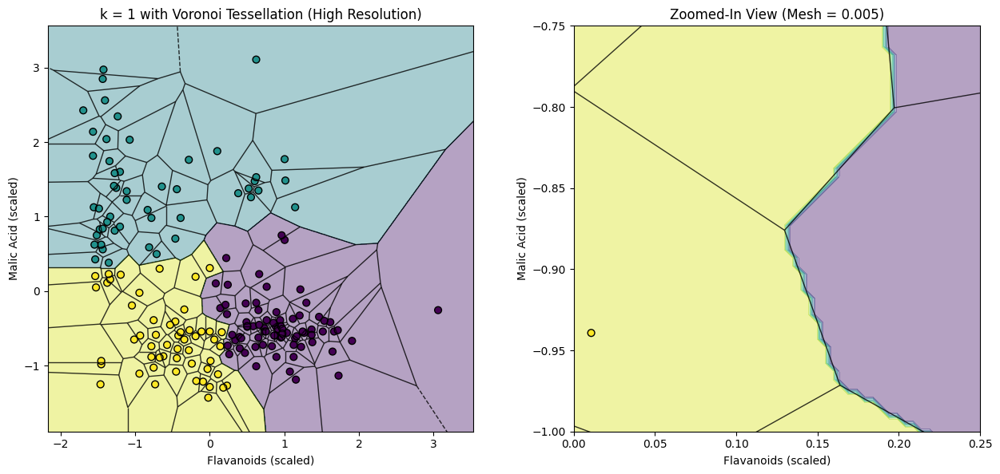

# Cluster–Voronoi Visualization

This notebook explores the geometric relationship between **k-Nearest Neighbors (k-NN)** classification boundaries and **Voronoi tessellations**.

---

## ✨ Overview
Using a wine dataset from Kaggle, the notebook:

- Scales numerical features using `RobustScaler`
- Performs clustering to assign class labels
- Trains a **k-NN classifier** (with *k = 1*)
- Plots decision boundaries and compares them to **Voronoi tessellations**
- Demonstrates how increasing mesh resolution refines the alignment between numerical and analytical borders

---

## 🧠 Key Insight
For `k = 1`, the decision regions of the k-NN classifier **closely align** with the **Voronoi cells** formed by the data points.  
This visualization highlights how nearest-neighbor algorithms carve space into regions based purely on distance — a geometric intuition behind how k-NN operates.

---

## 🖼️ Visual Results

### Mesh at 0.05

### Mesh at 0.005

The zoomed-in view shows that, although the Voronoi boundaries are *analytical* and the k-NN borders are *numerical*, increasing the mesh resolution makes them nearly indistinguishable.

---

## 🧰 Technologies Used
- **Python 3**
- `scikit-learn`
- `matplotlib`
- `scipy`
- `pandas`
- `seaborn`

---

## 💡 Takeaway
This simple yet powerful visualization connects **machine learning** and **geometry**, illustrating how classical distance-based algorithms can be understood through elegant spatial structures like the Voronoi diagram.

---


